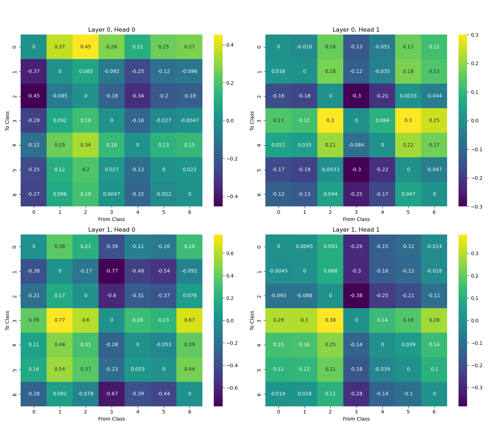
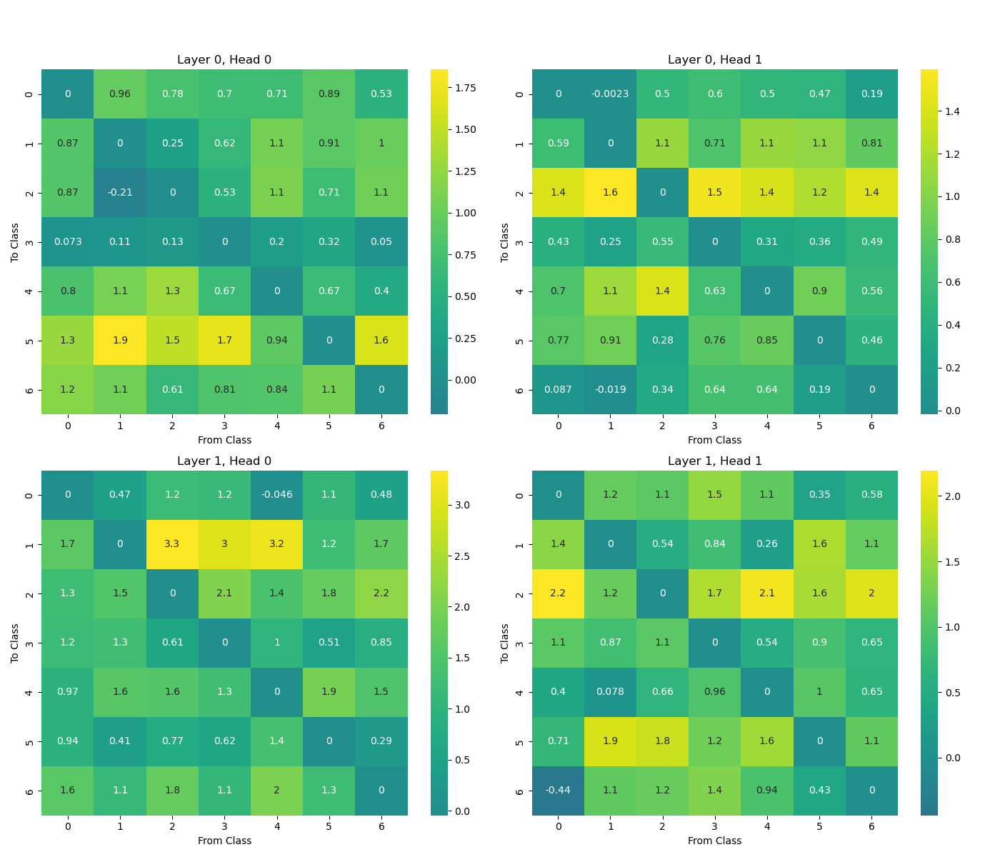
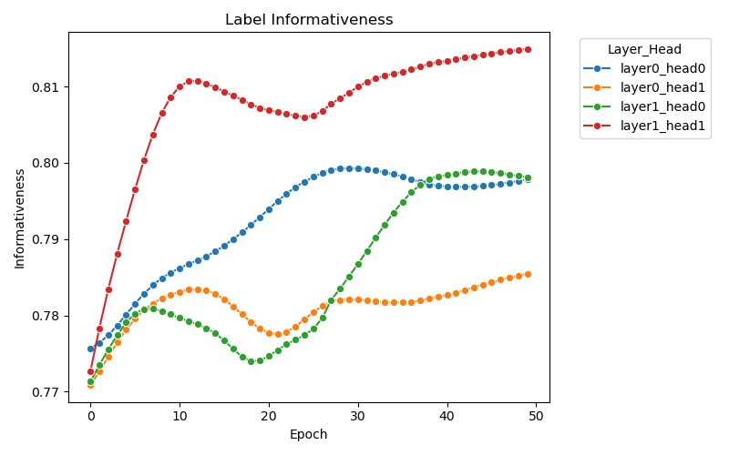

I intend this to be a preliminary exploration on recently deveoped applying mechanistic interpretability to graph neural neural networks. 

I was initially inspired by [this paper](https://arxiv.org/pdf/2502.12352), which focuse on the investigation of the attention matrix of some simple graph. But the specific techniques used in this paper is somewhat simplistic. In this work, I use transformer-lens library to capture the intermediate representation for more principled characterisation of the potential circuits in GNN. 

# Graph Transformer

There are many types of graph neural networks. But in their essenece, they are doing message passing on some graph. In particular, graph attention network is equivalent to transformer-based language with the following modification

1. The input vocab are all nodes in the graph (this is the primary reason why we can't use full transformer on large models due to $O(n^2)$ complexity of computing the softmax in attention)
2. The attention mask is the same as the adjacency matrix
3. The positional embedding is laplacian positional encoding
4. For classificaiton, the output vocab is classes

# Logit Lens on Graph Transformer 

Logit lens makes prediction from some intermediate representation in the transformer network. Since our output vocab is small we can take a snap shot of residual stream and project it to all pair logit difference directions. Making a (n_class, n_class) heatmap as following. 

The first thing to notice is each matrix is skew symmetric, this makes sense, if a head's output push the prediction in the direction of (1->2), it is the same as pushing the prediction away from 2 in the direction of (2->1). You can read the image by imaging a arrow going from x axis to y axis, and the value represent how much each head push the prediction in the direction of the arrow. For example, layer-head (0, 0) really likes to predict class 0, while steer the prediction away from class 2. 

In the following plot, I run logit attribution again, but only for those nodes having labels c1 for each (c1, c2) pair. 

Here we expect most if not all values to be positive. We can see (1, 1) is pretty indifferent in 0->6 direction for general population, but its not doing well for true samples. 

Now im kinda stuck, because we don't actually understand the input tokens. Note that the features of cora are a bunch of one-hot encoding of words but I cannot find the underlying vocabulary even after scortching the internet.

# Homophily and label informativeness

So is citation network actually useful? Genearlly there are two sort of intuition

- Homophily: Are the same class nodes more likely to connect with each other? E.g. If nodes with the same class are more likely to connect with other nodes of the same class, then the graph is probably useful
- Label Informativeness: Are nodes informativeness of its neighbours? E.g. Does observing one node reduce our uncertainty about its neighbours label

Note that label informativeness is a more generalised statement than homophily. And in reality, GNN is shown to perform reasonably well on high-heterophilous graph (aka. where nodes does not tend to connect to others of the same class). Though these two metrics are normally used on adjacency matrix, they can easily be extended to any positive matrix with shape (nodes, nodes) where each entry represent some kind of connection strength. 

$$
h_{edge} = \frac{\lVert WYY^{T} \rVert }{\lVert W 1_{n\times n} \rVert }
$$

$$
LI_{edge} = \frac{I(y_{u},y_{v})}{H(y_{u})} 
$$

I will just show label informativeness as it is just a better metric, here is the label informativeness of each head's attention matrix. 

This roughly tells you that during the training, the attention matrix learned tend to strength the connection between informative nodes. 

# The Graph Inductive Bias

So how does graph transformer incorporate graph into learning? There are 2 kinds of privileged basis specification on graph information. The positional embedding and the attention mask. The positional encoding is probably easier to interpret as it is commonly just chosen as the first d_model eigenvectors of the graph laplacian. 

